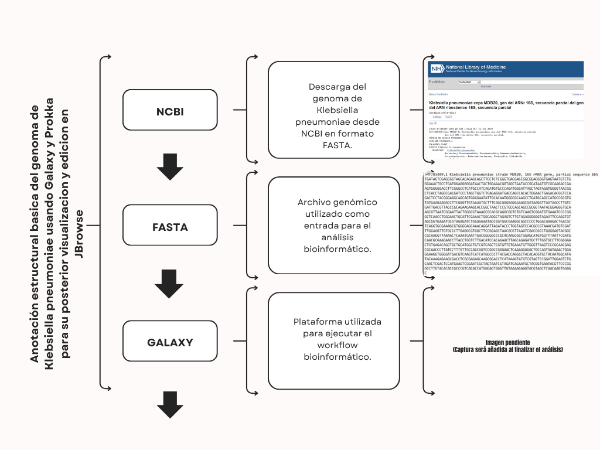
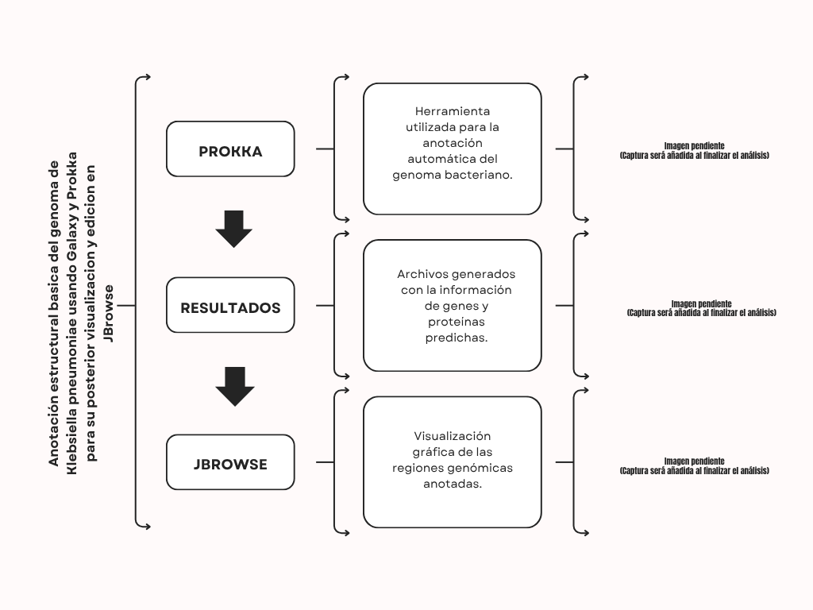

# MBM-3
Omicas 2026
Proyecto:  Anotación estructural basica del genoma de Klebsiella pneumoniae usando Galaxy y Prokka para su posterior visualizacion y edicion en JBrowse  
Integrantes  
* Castro Vanessa
* Guerra Diego
* Pinduisaca Máximo
* Rios Jonathan  
* Sarango Jhandry
  
## OBJETIVO
* Realizar la anotación estructural básica del genoma de Klebsiella pneumoniae mediante Galaxy y Prokka, y posteriormente visualizar y editar las anotaciones en JBrowse, con el fin de establecer un flujo bioinformático reproducible para proyectos académicos y de investigación aplicada.
  
## DATASET

## FLUJO DE TRABAJO
  * Descarga del genoma completo de K. pneumoniae desde NCBI GenBank o ENA.
  * Anotacion estructural con Prokka
  * Coversión y verificación de formatos
  * Instalar y configurar JBrowse
  * Visualiazión y edición del genoma en JBrowse
  * Conclusiones sobre la utilidad y aplicabilidad como flujo bioinformatico reproducible
    
  ### Workflow y organización

Como parte del equipo, se desarrolló y organizó el flujo de trabajo bioinformático del proyecto, asegurando la correcta secuencia de análisis.

  ### Workflow bioinformático

El workflow detallado es:

* NCBI → FASTA → Galaxy → Prokka → Resultados → Interpretación

Descripción del proceso:

  * NCBI: obtención de la secuencia genómica de Klebsiella pneumoniae.
  * FASTA: formato de archivo utilizado como entrada del análisis.
  * Galaxy: plataforma bioinformática para el procesamiento de datos.
  * Prokka: herramienta de anotación estructural del genoma bacteriano.
  * Resultados: generación de archivos con genes y anotaciones.
  * Interpretación: análisis biológico de los resultados obtenidos.

Se incluyen evidencias visuales del proceso en la carpeta images/ del repositorio.
## RESULTADOS
## CONTRIBUCIÓN INDIVIDUAL
* Resumen breve  
## SCRIPTS  
