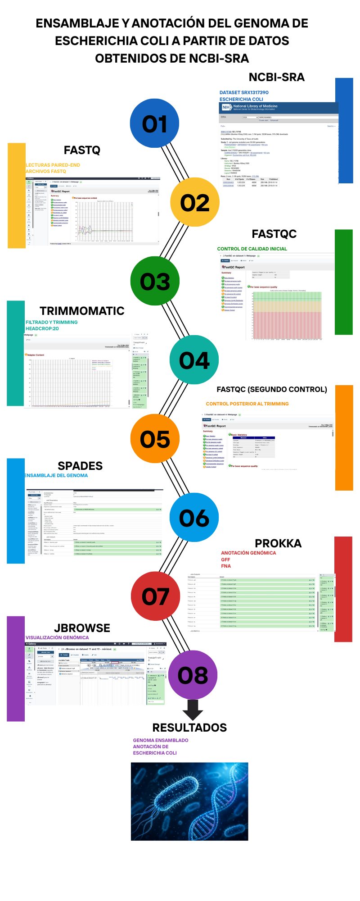

# MBM-3
Omicas 2026  
# Proyecto:  Ensamblaje y anotación estructural del genoma de *Escherichia coli* usando Galaxy y Prokka para su posterior visualizacion y edicion en JBrowse  
## Integrantes  
* Castro Vanessa
* Guerra Diego
* Pinduisaca Máximo
* Rios Jonathan  
* Sarango Jhandry

## Planteamiento del problema
* El ensamblaje y la anotación estructural de genomas bacterianos constituyen procesos fundamentales en la genómica funcional y bioinformática, debido a su importancia en la identificación de genes, regiones codificantes y elementos regulatorios. Sin embargo, la integración de herramientas como Galaxy, Prokka y JBrowse presenta limitaciones relacionadas con la reproducibilidad, compatibilidad de formatos y correcta interpretación de datos genómicos. En el caso de *Escherichia coli*, una anotación deficiente puede afectar la identificación precisa de genes y la visualización estructural del genoma. Por ello, se plantea implementar un flujo de trabajo bioinformático para el ensamblaje, anotación estructural y posterior visualización genómica, optimizando la organización, análisis y edición de la información genética bacteriana.

 * Una vez ensamblado el genoma, se aplicó Prokka para identificar genes, regiones codificantes, ARN ribosomal y otros elementos genéticos presentes en el organismo. Los archivos generados en formatos FASTA y GFF fueron posteriormente integrados en JBrowse para la visualización y edición de la estructura genómica de *Escherichia coli*. Este flujo de trabajo permitió desarrollar un análisis reproducible y organizado, fortaleciendo competencias en genómica, anotación estructural y manejo de herramientas bioinformáticas aplicadas al análisis molecular bacteriano.

## Objetivo
* Realizar el ensamblaje y la anotación estructural del genoma de *Escherichia coli* utilizando datos provenientes de NCBI-SRA, mediante herramientas bioinformáticas como FastQC, Trimmomatic, SPAdes, Prokka y JBrowse, para obtener un genoma anotado e interpretable biológicamente.

## Dataset
NCBI -> SRR2584863	
Organismo: *Escherichia coli*
https://www.ncbi.nlm.nih.gov/sra/?term=SRR2584863
Illumina HiSeq 2500  

 ## Identificación de secuencia fatsq *Escherichia coli* 
* La secuencia se obtuvo de la base de datos NCBI  
* https://trace.ncbi.nlm.nih.gov/Traces/?run=SRR2584863  
* La elección e importancia del estudio de *Escherichia coli* radica en su rol como organismo modelo, su gran versatilidad y capacidad de analisis permite validar herramientas bioinformáticas de ensamblaje y además estudiar los mecanismos de adaptación y resistencia.
 

## Flujo de trabajo
* El flujo de trabajo utilizado en el proyecto sigue un proceso estándar de análisis genómico, desde la obtención de datos crudos hasta la anotación e interpretación biológica final.

* NCBI-SRA → FASTQ → FastQC → Trimmomatic → FastQC → SPAdes → Prokka → JBrowse → Resultados

  

  * Descarga del genoma E. coli desde NCBI GenBank SRR2584863 
  * Control Calidad Datos
  * Trimming
  * Ensamblaje
  * Anotacion estructural con Prokka
  * Instalar y configurar JBrowse
  * Visualiazión y edición del genoma en JBrowse
  * Conclusiones sobre la utilidad y aplicabilidad como flujo bioinformatico reproducible  
  
## Resultados

* Los resultados del análisis realizado en Galaxy mostraron que las lecturas obtenidas de NCBI presentaron buena calidad general y un contenido GC cercano al 50%, consistente con Escherichia coli. La presencia de adaptadores y regiones de baja calidad fue corregida mediante Trimmomatic, mejorando la precisión de las lecturas (Q > 30).
* Posteriormente, con Prokka y JBrowse, se obtuvo un genoma ensamblado y anotado funcionalmente, identificando genes y enzimas metabólicas relevantes, además de archivos interpretables y visualización genómica adecuada.

## Contribucion individual

Maximo Pinduisaca — Búsqueda de secuencias y planteamiento biológico
Responsable de:
* Buscar información sobre el organismo seleccionado para el proyecto.  
* Explicar la importancia biológica y microbiológica del organismo estudiado.  
* Buscar y descargar la secuencia FASTQ desde bases de datos públicas como NCBI.  
* Subir la secuencia al repositorio GitHub en la carpeta data/raw/.  

Jhandry Sarango - Galaxy y analisis bioinformatico
Responsable de:
• Trabajar en Galaxy para ejecutar el análisis bioinformático.  
• Importar la secuencia FASTQ en Galaxy.  
• Ejecutar Prokka para realizar la anotación genómica.  
• Subir resultados al repositorio GitHub en la carpeta resultados  
• Verificar archivos generados  

Vanessa Castro  — Workflow y organización del proyecto
Responsable de:
• Crear el workflow bioinformático del proyecto.  
• Elaborar y explicar el diagrama del flujo de trabajo  
• Organizar carpetas y archivos dentro del repositorio GitHub.  

Diego Guerra — README y línea de comandos
Responsable de:
* Redactar y organizar el archivo README.md en GitHub.  
* Documentar:  
o objetivo,
o metodología,
o dataset,
o flujo de trabajo,
o resultados del proyecto.

Jonathan Rios — Interpretacion biologica e informe.md  
Integrar y organizar el informe.md en GitHub.  
• Organizar capturas y explicaciones del proyecto.  
• Redactar la interpretación biológica preliminar de los resultados obtenidos.  
• Explicar la importancia biológica del organismo o secuencia analizada.  
• Documentar el trabajo colaborativo realizado durante el proyecto.  
• Explicar el uso de herramientas de IA utilizadas como apoyo.  

## SCRIPTS  
fastqc SRRSRR2584863.fastq
 
java -jar /usr/share/java/trimmomatic-0.39.jar SE -phred33 SRR2584863.fastq SRR2584863_trimmed.fastq HEADCROP:20 LEADING:3 TRAILING:3 SLIDINGWINDOW:4:20 MINLEN:36 2>&1 | tee trimming.log
 
fastqc SRR2584863_trimmed.fastq

spades.py --isolate -s SRR2584863_trimmed.fastq -o spades_output -t 2 -m 2
 
seqkit stats scaffolds.fasta
 
bwa index scaffolds_fasta
 
bwa mem ../scaffolds.fasta ../SRR2584863_trimmed.fastq -o bwaFile.sam
